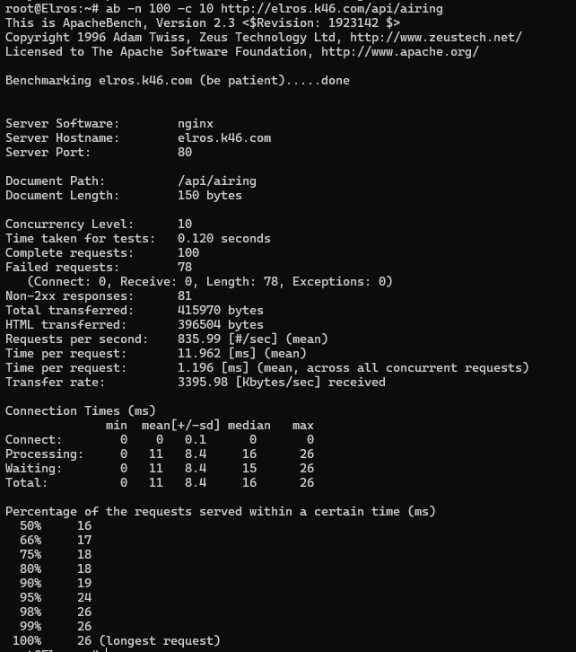
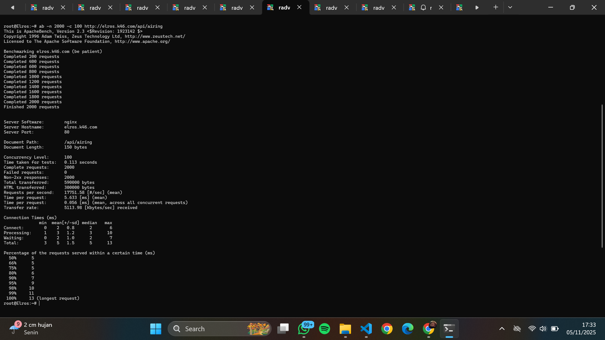
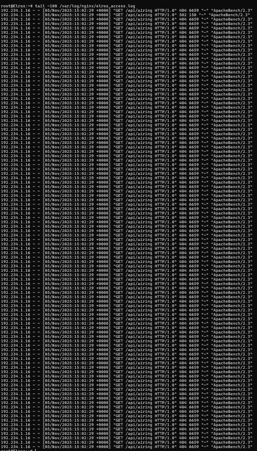

# Jarkom-Modul-3-2025-K46
===========[Kelompok 46]=============

Mutiara Diva Jaladitha - 5027241083

Abiyyu Raihan Putra Wikanto - 5027241042

============[PENJELASAN SOAL]=============
## soal_1 
_Di awal Zaman Kedua, setelah kehancuran Beleriand, para Valar menugaskan untuk membangun kembali jaringan komunikasi antar kerajaan. Para Valar menyalakan Minastir, Aldarion, Erendis, Amdir, Palantir, Narvi, Elros, Pharazon, Elendil, Isildur, Anarion, Galadriel, Celeborn, Oropher, Miriel, Amandil, Gilgalad, Celebrimbor, Khamul, dan pastikan setiap node (selain Durin sang penghubung antar dunia) dapat sementara berkomunikasi dengan Valinor/Internet (nameserver 192.168.122.1) untuk menerima instruksi awal._

### Langkah Pengerjaan
Mengkonfigurasi router (Durin) dengan berikut agar bisa terhubung dengan switch :
    auto lo
    iface lo inet loopback
    
    # WAN - to NAT/host, get DHCP
    auto eth0
    iface eth0 inet dhcp
    
    # LAN1 - Switch1 (192.234.1.0/24)
    auto eth1
    iface eth1 inet static
        address 192.234.1.1
        netmask 255.255.255.0
    
    # LAN2 - Switch2 (192.234.2.0/24)
    auto eth2
    iface eth2 inet static
        address 192.234.2.1
        netmask 255.255.255.0
    
    # LAN3 - Switch3 / Switch6 (192.234.4.0/24)
    auto eth3
    iface eth3 inet static
        address 192.234.4.1
        netmask 255.255.255.0
    
    # LAN4 - Switch4 & servers (192.234.3.0/24) -> eth4
    auto eth4
    iface eth4 inet static
        address 192.234.3.1
        netmask 255.255.255.0
    
    # LAN5 - Minastir (separate subnet, attached to eth5) -> 192.234.5.0/24
    auto eth5
    iface eth5 inet static
        address 192.234.5.1
        netmask 255.255.255.0
        
Lalu melakukan IP forwarding menggunakan berikut :

    sysctl -w net.ipv4.ip_forward=1 >/dev/null

Menambahkan masquarade :

    iptables -t nat -A POSTROUTING -o eth0 -s 192.234.0.0/16 -j MASQUERADE
    
    Serta menambahkan aturan FORWARF untuk setiap eth :
    for lan in eth1 eth2 eth3 eth4 eth5; do
      iptables -C FORWARD -i $lan -o eth0 -j ACCEPT 2>/dev/null || iptables -A FORWARD -i $lan -o eth0 -j ACCEPT
      iptables -C FORWARD -i eth0 -o $lan -m state --state RELATED,ESTABLISHED -j ACCEPT 2>/dev/null || \
        iptables -A FORWARD -i eth0 -o $lan -m state --state RELATED,ESTABLISHED -j ACCEPT
    done

Setelah itu melakukan konfigurasi pada setiap node (Node memiliki static, dynamic, atau fixed address):
    # Minastir — DNS Forwarder — nevarre/gns3-debi:new
    auto lo
    iface lo inet loopback
    
    auto eth0
    iface eth0 inet static
        address 192.234.5.10
        netmask 255.255.255.0
        gateway 192.234.5.1
        up echo nameserver 192.168.122.1 > /etc/resolv.conf
    
    # Aldarion — DHCP Server — nevarre/gns3-debi:new
    auto lo
    iface lo inet loopback
    
    auto eth0
    iface eth0 inet static
        address 192.234.3.13
        netmask 255.255.255.0
        gateway 192.234.3.1
        up echo nameserver 192.168.122.1 > /etc/resolv.conf
    
    # Erendis — DNS Master — nevarre/gns3-debi:new
    auto lo
    iface lo inet loopback
    
    auto eth0
    iface eth0 inet static
        address 192.234.4.12
        netmask 255.255.255.0
        gateway 192.234.4.1
        up echo nameserver 192.168.122.1 > /etc/resolv.conf
    
    # Amdir — DNS Slave — nevarre/gns3-debi:new
    auto lo
    iface lo inet loopback
    
    auto eth0
    iface eth0 inet static
        address 192.234.4.13
        netmask 255.255.255.0
        gateway 192.234.4.1
        up echo nameserver 192.168.122.1 > /etc/resolv.conf
    
    # Palantir — Database Server — nevarre/gns3-debi:new
    auto lo
    iface lo inet loopback
    
    auto eth0
    iface eth0 inet static
        address 192.234.3.12
        netmask 255.255.255.0
        gateway 192.234.3.1
        up echo nameserver 192.168.122.1 > /etc/resolv.conf
    
    # Narvi — Database Slave — nevarre/gns3-debi:new
    auto lo
    iface lo inet loopback
    
    auto eth0
    iface eth0 inet static
        address 192.234.3.14
        netmask 255.255.255.0
        gateway 192.234.3.1
        up echo nameserver 192.168.122.1 > /etc/resolv.conf
    
    # Elros — Load Balancer (Laravel) — nevarre/gns3-debi:new
    auto lo
    iface lo inet loopback
    
    auto eth0
    iface eth0 inet static
        address 192.234.1.16
        netmask 255.255.255.0
        gateway 192.234.1.1
        up echo nameserver 192.168.122.1 > /etc/resolv.conf
    
    # Pharazon — Load Balancer (PHP) — nevarre/gns3-debi:new
    auto lo
    iface lo inet loopback
    
    auto eth0
    iface eth0 inet static
        address 192.234.2.13
        netmask 255.255.255.0
        gateway 192.234.2.1
        up echo nameserver 192.168.122.1 > /etc/resolv.conf
    
    # Elendil — Laravel Worker-1 — nevarre/gns3-debi:new
    auto lo
    iface lo inet loopback
    
    auto eth0
    iface eth0 inet static
        address 192.234.1.11
        netmask 255.255.255.0
        gateway 192.234.1.1
        up echo nameserver 192.168.122.1 > /etc/resolv.conf
    
    # Isildur — Laravel Worker-2 — nevarre/gns3-debi:new
    auto lo
    iface lo inet loopback
    
    auto eth0
    iface eth0 inet static
        address 192.234.1.12
        netmask 255.255.255.0
        gateway 192.234.1.1
        up echo nameserver 192.168.122.1 > /etc/resolv.conf
    
    # Anarion — Laravel Worker-3 — nevarre/gns3-debi:new
    auto lo
    iface lo inet loopback
    
    auto eth0
    iface eth0 inet static
        address 192.234.1.13
        netmask 255.255.255.0
        gateway 192.234.1.1
        up echo nameserver 192.168.122.1 > /etc/resolv.conf
    
    # Galadriel — PHP Worker-1 — nevarre/gns3-debi:new
    auto lo
    iface lo inet loopback
    
    auto eth0
    iface eth0 inet static
        address 192.234.2.21
        netmask 255.255.255.0
        gateway 192.234.2.1
        up echo nameserver 192.168.122.1 > /etc/resolv.conf
    
    # Celeborn — PHP Worker-2 — nevarre/gns3-debi:new
    auto lo
    iface lo inet loopback
    
    auto eth0
    iface eth0 inet static
        address 192.234.2.22
        netmask 255.255.255.0
        gateway 192.234.2.1
        up echo nameserver 192.168.122.1 > /etc/resolv.conf
    
    # Oropher — PHP Worker-3 — nevarre/gns3-debi:new
    auto lo
    iface lo inet loopback
    
    auto eth0
    iface eth0 inet static
        address 192.234.2.23
        netmask 255.255.255.0
        gateway 192.234.2.1
        up echo nameserver 192.168.122.1 > /etc/resolv.conf
    
    # Miriel — Client-Static-1 — nevarre/gns3-debi:new
    auto lo
    iface lo inet loopback
    
    auto eth0
    iface eth0 inet static
        address 192.234.1.14
        netmask 255.255.255.0
        gateway 192.234.1.1
        up echo nameserver 192.168.122.1 > /etc/resolv.conf
    
    # Celebrimbor — Client-Static-2 — nevarre/gns3-debi:new
    auto lo
    iface lo inet loopback
    
    auto eth0
    iface eth0 inet static
        address 192.234.2.12
        netmask 255.255.255.0
        gateway 192.234.2.1
        up echo nameserver 192.168.122.1 > /etc/resolv.conf
    
    # Gilgalad — Client-Dynamic-1 (DHCP) — nevarre/gns3-debi:new
    auto lo
    iface lo inet loopback
    
    auto eth0
    iface eth0 inet dhcp
        up echo nameserver 192.168.122.1 > /etc/resolv.conf
    
    # Amandil — Client-Dynamic-2 (DHCP) — nevarre/gns3-debi:new
    auto lo
    iface lo inet loopback
    
    auto eth0
    iface eth0 inet dhcp
        up echo nameserver 192.168.122.1 > /etc/resolv.conf
    
    # Khamul — Client-Fixed-Address — nevarre/gns3-debi:new
    auto lo
    iface lo inet loopback
    
    auto eth0
    iface eth0 inet static
        address 192.234.4.11
        netmask 255.255.255.0
        gateway 192.234.4.1
        up echo nameserver 192.168.122.1 > /etc/resolv.conf

Hasil ketika mencoba ping :


## soal_2
_Raja Pelaut Aldarion, penguasa wilayah Númenor, memutuskan cara pembagian tanah client secara dinamis. Ia menetapkan:_
- _Client Dinamis Keluarga Manusia: Mendapatkan tanah di rentang [prefix ip].1.6 - [prefix ip].1.34 dan [prefix ip].1.68 - [prefix ip].1.94._
- _Client Dinamis Keluarga Peri: Mendapatkan tanah di rentang [prefix ip].2.35 - [prefix ip].2.67 dan [prefix ip].2.96 - [prefix ip].2.121._
- _Khamul yang misterius: Diberikan tanah tetap di [prefix ip].3.95, agar keberadaannya selalu diketahui. Pastikan Durin dapat menyampaikan dekrit ini ke semua wilayah yang terhubung dengannya._


### Langkah Pengerjaan

Untuk soal 2 diperlukan pengerjaan pada 2 node yaitu Aldarion (DHCP Server) dan Durin (Router). Pada Aldarion dapat dijalankan berikut agar bisa menjadi DHCP Server :

    apt-get update -y
    apt-get install -y isc-dhcp-server

Lalu di /etc/dhcp/dhcpd.conf dimasukkan konfigurasi berikut untuk menentukan subnet :

    # === DHCP SERVER K46 ===
    ddns-update-style none;
    option domain-name "numenor.lab";
    option domain-name-servers 192.234.5.10;  # Minastir sebagai DNS Forwarder
    default-lease-time 600;
    max-lease-time 3600;
    authoritative;
    
    # ==============================
    # Subnet untuk Keluarga Manusia
    # ==============================
    subnet 192.234.1.0 netmask 255.255.255.0 {
        range 192.234.1.6 192.234.1.34;
        range 192.234.1.68 192.234.1.94;
        option routers 192.234.1.1;
        option broadcast-address 192.234.1.255;
        option domain-name-servers 192.234.5.10;
        default-lease-time 1800;
        max-lease-time 3600;
    }
    
    # ===========================
    # Subnet untuk Keluarga Peri
    # ===========================
    subnet 192.234.2.0 netmask 255.255.255.0 {
        range 192.234.2.35 192.234.2.67;
        range 192.234.2.96 192.234.2.121;
        option routers 192.234.2.1;
        option broadcast-address 192.234.2.255;
        option domain-name-servers 192.234.5.10;
        default-lease-time 600;
        max-lease-time 3600;
    }
    
    # ==========================
    # Subnet internal Aldarion
    # ==========================
    subnet 192.234.3.0 netmask 255.255.255.0 {
        option routers 192.234.3.1;
        option broadcast-address 192.234.3.255;
        option domain-name-servers 192.234.5.10;
    }
    
    # ======================
    # Subnet tambahan lainnya
    # ======================
    subnet 192.234.4.0 netmask 255.255.255.0 {
        option routers 192.234.4.1;
        option broadcast-address 192.234.4.255;
        option domain-name-servers 192.234.5.10;
    }
    
    # ========================
    # Fixed address untuk Khamul
    # ========================
    host khamul {
        hardware ethernet 02:42:ac:11:00:01;  # Ganti MAC sesuai hasil "ip link show eth0" di Khamul
        fixed-address 192.234.3.95;
        option routers 192.234.3.1;
        option domain-name-servers 192.234.5.10;

Lalu untuk mengatur agar DHCP Server aktif di interface Aldarion :

    cat > /etc/default/isc-dhcp-server <<'EOF'
    INTERFACESv4="eth0"
    INTERFACESv6=""
    EOF

Untuk mengaktifkan layanan server bisa menggunakan :

    service isc-dhcp-server restart || /usr/sbin/dhcpd -4 -f -d eth0 &

Setelah semua tadi sudah dilakukan, Durin dijadikan DHCP Relay dengan menjalankan berikut :

    # Menginstall dhcp relay
    apt-get update -y
    apt-get install -y isc-dhcp-relay

Menulis konfigurasi ke /etc/default/isc-dhcp-relay agar bisa terhubung :

    
    cat > /etc/default/isc-dhcp-relay <<'EOF'
    # DHCP Server tujuan (Aldarion di subnet 192.234.3.0/24)
    SERVERS="192.234.3.13"
    
    
    # Interface yang menerima permintaan DHCP (dari subnet dynamic)
    # eth1 = Human (192.234.1.0/24)
    # eth2 = Elf (192.234.2.0/24)
    INTERFACES="eth1 eth2"
    
    
    # Opsi tambahan (-a agar menyertakan alamat relay)
    OPTIONS="-a"
    EOF

Lalu bisa dilanjutkan dengan mengaktifkan layanan dhcp relay dengan berikut :

    service isc-dhcp-relay restart || /usr/sbin/dhcrelay -4 -d 192.234.3.13 eth1 eth2 &

## soal_3
_Untuk mengontrol arus informasi ke dunia luar (Valinor/Internet), sebuah menara pengawas, Minastir didirikan. Minastir mengatur agar semua node (kecuali Durin) hanya dapat mengirim pesan ke luar Arda setelah melewati pemeriksaan di Minastir._

### Langkah Pengerjaan

Soal ini meminta untuk menjadikan Minastir sebagai DNS Forwarder. Hal tersebut dilakukan pertama dengan menginstall beberapa hal termasuk bind9 :

    apt-get update -y
    apt-get install -y bind9 bind9-utils bind9-doc dnsutils

Setelah itu mengatur konfigurasi DNS Forwarder :

    cat > /etc/bind/named.conf.options <<EOF
    options {
        directory "/var/cache/bind";
        forwarders {
            192.168.122.1;
        };
        allow-query { any; };
        listen-on { any; };
        recursion yes;
    };
    EOF

Dilanjutkan dengan mengatur resolv.conf agar menggunakan localhost :

    rm -f /etc/resolv.conf #Agar tidak bentrok jika sudah ada
    echo "nameserver 127.0.0.1" > /etc/resolv.conf

Menjalankan proses named secara manual :

    pkill named 2>/dev/null || true
    /usr/sbin/named -f -g &>/var/log/named.log &

Menambahkan aturan NAT (Minastir sebagai penghubung ke Internet) :

    #   eth0 → terhubung ke Durin (192.234.5.0/24)
    #   eth1 → terhubung ke NAT/Internet (192.168.122.0/24)
    iptables -t nat -F
    iptables -F
    
    
    echo "[*] Menambahkan aturan NAT..."
    iptables -t nat -A POSTROUTING -o eth1 -s 192.234.0.0/16 -j MASQUERADE

Izinkan forwarding dari LAN (Durin dan semua node) ke Internet :

    iptables -A FORWARD -i eth0 -o eth1 -j ACCEPT
    iptables -A FORWARD -i eth1 -o eth0 -m state --state RELATED,ESTABLISHED -j ACCEPT

Menghentikan proses lama, dan menjalankan named di background :

    pkill named 2>/dev/null || true
    /usr/sbin/named -f -g &>/var/log/named.log &
    echo "/usr/sbin/named started; logs in /var/log/named.log"


Simpan aturan iptables agar tidak hilang :

    if command -v iptables-save >/dev/null 2>&1; then
      iptables-save > /etc/iptables.rules
    fi


## soal_4
_Ratu Erendis, sang pembuat peta, menetapkan nama resmi untuk wilayah utama (<xxxx>.com). Ia menunjuk dirinya (ns1.<xxxx>.com) dan muridnya Amdir (ns2.<xxxx>.com) sebagai penjaga peta resmi. Setiap lokasi penting (Palantir, Elros, Pharazon, Elendil, Isildur, Anarion, Galadriel, Celeborn, Oropher) diberikan nama domain unik yang menunjuk ke lokasi fisik tanah mereka. Pastikan Amdir selalu menyalin peta (master-slave) dari Erendis dengan setia._

### Langkah Pengerjaan

Pertama menjalankan script dan konfigurasi pada Erendis. Untuk mengisi Erendis sebagai DNS master dengan berikut :

        DOMAIN="k46"
        TLD="com"
        MASTER_IP="192.234.4.12"
        SLAVE_IP="192.234.4.13"
        FORWARDER="192.234.5.10"   # Minastir
        
        
        SERIAL=$(date +%Y%m%d%H)


Install bind9:

        apt-get update -y
        apt-get install -y bind9 bind9utils bind9-doc dnsutils


Mengisi named.conf.options (forwarder -> Minastir) :

        cat > /etc/bind/named.conf.options <<EOF
        options {
            directory "/var/cache/bind";
            forwarders { ${FORWARDER}; };
            allow-query { any; };
            recursion yes;
            listen-on { any; };
        };
        EOF


Mengisi named.conf.local (master zone) :

        cat > /etc/bind/named.conf.local <<EOF
        zone "${DOMAIN}.${TLD}" {
            type master;
            file "/etc/bind/db.${DOMAIN}.${TLD}";
            allow-transfer { ${SLAVE_IP}; };
            also-notify { ${SLAVE_IP}; };
        };
        EOF


Membuat file zone /etc/bind/db.${DOMAIN}.${TLD} :

        cat > /etc/bind/db.${DOMAIN}.${TLD} <<EOF
        \$TTL    604800
        @       IN      SOA     ns1.${DOMAIN}.${TLD}. root.${DOMAIN}.${TLD}. (
                                ${SERIAL} ; Serial
                                604800     ; Refresh
                                86400      ; Retry
                                2419200    ; Expire
                                604800 )   ; Negative Cache TTL
        
        
        ; Name Servers
        @       IN      NS      ns1.${DOMAIN}.${TLD}.
        @       IN      NS      ns2.${DOMAIN}.${TLD}.
        ns1     IN      A       ${MASTER_IP}
        ns2     IN      A       ${SLAVE_IP}
        
        
        ; Important hosts (sesuaikan jika perlu)
        palantir    IN  A   192.234.3.12
        elros       IN  A   192.234.1.16
        pharazon    IN  A   192.234.2.13
        elendil     IN  A   192.234.1.11
        isildur     IN  A   192.234.1.12
        anarion     IN  A   192.234.1.13
        galadriel   IN  A   192.234.2.21
        celeborn    IN  A   192.234.2.22
        oropher     IN  A   192.234.2.23
        EOF


Memastikan file permission benar dengan berikut :

        chown root:bind /etc/bind/db.${DOMAIN}.${TLD}
        chmod 644 /etc/bind/db.${DOMAIN}.${TLD}


Mengecek file zona sebelum start named dengan menggunakan :

        if ! named-checkzone ${DOMAIN}.${TLD} /etc/bind/db.${DOMAIN}.${TLD} >/dev/null 2>&1; then
          echo "ERROR: named-checkzone gagal. Tampilkan kesalahan:"
          named-checkzone ${DOMAIN}.${TLD} /etc/bind/db.${DOMAIN}.${TLD}
          exit 1
        fi


Melakukan backup resolv.conf lalu set resolver lokal :

        cp -n /etc/resolv.conf /etc/resolv.conf.bak || true
        echo "nameserver 127.0.0.1" > /etc/resolv.conf


Untuk memastikan slave bisa melakukan AXFR (terima TCP/53 & UDP/53 dari slave) bisa dengan menulis :

        iptables -C INPUT -p tcp -s ${SLAVE_IP} --dport 53 -j ACCEPT 2>/dev/null || \
          iptables -I INPUT -p tcp -s ${SLAVE_IP} --dport 53 -j ACCEPT
        iptables -C INPUT -p udp -s ${SLAVE_IP} --dport 53 -j ACCEPT 2>/dev/null || \
          iptables -I INPUT -p udp -s ${SLAVE_IP} --dport 53 -j ACCEPT


Menjalankan named menggunakan command berikut :

        pkill named 2>/dev/null || true
        /usr/sbin/named -f -g &>/var/log/named-erendis.log &
        sleep 1


Melakukan verifikasi, apakah untuk soal 4 sudah dijalankan dengan benar :

        dig SOA ${DOMAIN}.${TLD} @127.0.0.1 +noall +answer || true

Untuk menjadikan Amdir sebagai DNS slave bisa dimulai dengan berikut :

        DOMAIN="k46"
        TLD="com"
        MASTER_IP="192.234.4.12"
        SLAVE_IP="192.234.4.13"
        FORWARDER="192.234.5.10"   # Minastir


Install bind9 agar bisa jalan :

        apt-get update -y
        apt-get install -y bind9 bind9utils bind9-doc dnsutils


Mengisi named.conf.options (forwarder -> Minastir) :

        cat > /etc/bind/named.conf.options <<EOF
        options {
            directory "/var/cache/bind";
            forwarders { ${FORWARDER}; };
            allow-query { any; };
            recursion yes;
            listen-on { any; };
        };
        EOF


Mengisi named.conf.local (slave zone config) :

        cat > /etc/bind/named.conf.local <<EOF
        zone "${DOMAIN}.${TLD}" {
            type slave;
            masters { ${MASTER_IP}; };
            file "/var/lib/bind/db.${DOMAIN}.${TLD}";
        };
        EOF


Memastikan direktori tujuan ada :

        mkdir -p /var/lib/bind
        chown bind:bind /var/lib/bind || true
        chmod 755 /var/lib/bind


Melakukan backup resolv.conf sebelum menggantikannya :
        
        cp -n /etc/resolv.conf /etc/resolv.conf.bak || true
        echo "nameserver 127.0.0.1" > /etc/resolv.conf


Menjalankan proses named :
        
        pkill named 2>/dev/null || true
        /usr/sbin/named -f -g &>/var/log/named-amdir.log &

Memastikan bahwa slave zone file ada :

        sleep 3
        if [ -f /var/lib/bind/db.${DOMAIN}.${TLD} ]; then
          echo "Slave zone file exists:"
          ls -l /var/lib/bind/db.${DOMAIN}.${TLD}
        else
          echo "Slave zone file belum ada — slave akan mencoba AXFR dari master jika master reachable & allow-transfer diaktifkan."
        fi
        sleep 3


Memeriksa file slave: ls -l /var/lib/bind/db.${DOMAIN}.${TLD} :

        ls -l /var/lib/bind/db.${DOMAIN}.${TLD} || echo "Belum ada file zona (slave akan menarik dari master otomatis jika master reachable & allow-transfer diaktifkan)."


Verifikasi:\n - di Amdir: dig SOA ${DOMAIN}.${TLD} @127.0.0.1\n - di Amdir (AXFR test dari master): dig @${MASTER_IP} ${DOMAIN}.${TLD} AXFR :

        dig SOA ${DOMAIN}.${TLD} @127.0.0.1 +noall +answer || true

Jika transfer belum terjadi, pastikan master (Erendis) reachable dari Amdir: ping ${MASTER_IP}


## soal_5
_Untuk memudahkan, nama alias www.<xxxx>.com dibuat untuk peta utama <xxxx>.com. Reverse PTR juga dibuat agar lokasi Erendis dan Amdir dapat dilacak dari alamat fisik tanahnya. Erendis juga menambahkan pesan rahasia (TXT record) pada petanya: "Cincin Sauron" yang menunjuk ke lokasi Elros, dan "Aliansi Terakhir" yang menunjuk ke lokasi Pharazon. Pastikan Amdir juga mengetahui pesan rahasia ini._

### Langkah Pengerjaan


## soal_6
_Aldarion menetapkan aturan waktu peminjaman tanah. Ia mengatur:_
- _Client Dinamis Keluarga Manusia dapat meminjam tanah selama setengah jam._
- _Client Dinamis Keluarga Peri hanya seperenam jam._
_Batas waktu maksimal peminjaman untuk semua adalah satu jam._

### Langkah Pengerjaan

Soal ini meminta untuk membatasi leasing time jadi setengah jam, seperenam jam, atau satu jam. Di Aldarion, dijalankan berikut :

        DHCP_CONF="/etc/dhcp/dhcpd.conf"
        BACKUP="${DHCP_CONF}.$(date +%s).bak"

Backup existing dhcpd.conf -> $BACKUP :

        cp -n "$DHCP_CONF" "$BACKUP" 2>/dev/null || true

Memasukkan ke DHCP Config :

        cat > "$DHCP_CONF" <<'EOF'
        # === DHCP SERVER K46 ===
        ddns-update-style none;
        option domain-name "numenor.lab";
        option domain-name-servers 192.234.5.10;  # Minastir
        default-lease-time 600;
        max-lease-time 3600;
        authoritative;
        
        # Manusia: lease 30 menit (1800s)
        subnet 192.234.1.0 netmask 255.255.255.0 {
            range 192.234.1.6 192.234.1.34;
            range 192.234.1.68 192.234.1.94;
            option routers 192.234.1.1;
            option broadcast-address 192.234.1.255;
            option domain-name-servers 192.234.5.10;
            default-lease-time 1800;
            max-lease-time 3600;
        }
        
        # Peri: lease 10 menit (600s)
        subnet 192.234.2.0 netmask 255.255.255.0 {
            range 192.234.2.35 192.234.2.67;
            range 192.234.2.96 192.234.2.121;
            option routers 192.234.2.1;
            option broadcast-address 192.234.2.255;
            option domain-name-servers 192.234.5.10;
            default-lease-time 600;
            max-lease-time 3600;
        }
        
        # internal Aldarion subnet
        subnet 192.234.3.0 netmask 255.255.255.0 {
            option routers 192.234.3.1;
            option broadcast-address 192.234.3.255;
            option domain-name-servers 192.234.5.10;
        }
        
        # other subnets (no change)
        subnet 192.234.4.0 netmask 255.255.255.0 {
            option routers 192.234.4.1;
            option broadcast-address 192.234.4.255;
            option domain-name-servers 192.234.5.10;
        }
        
        host khamul {
            hardware ethernet 02:42:ac:11:00:01;
            fixed-address 192.234.3.95;
            option routers 192.234.3.1;
            option domain-name-servers 192.234.5.10;
        }
        EOF

Memastikan directories peminjaman ada :

        mkdir -p /var/lib/dhcp
        touch /var/lib/dhcp/dhcpd.leases
        chown root:root /var/lib/dhcp/dhcpd.leases
        chmod 644 /var/lib/dhcp/dhcpd.leases

Melakukan restart DHCP server (try service/init.d fallback) :

        service isc-dhcp-server restart 2>/dev/null || service dhcpd restart 2>/dev/null || /usr/sbin/dhcpd -4 -cf "$DHCP_CONF" eth0 2>/dev/null || true

Server dipastikan bekerja menggunakan command berikut :

        # pastikan nilai lease ada
        grep -n "default-lease-time" /etc/dhcp/dhcpd.conf
        
        # pastikan dhcpd jalan
        ps aux | grep dhcpd | grep -v grep || echo "dhcpd tidak jalan"
        
        # lihat lease file (client yang sudah mendapat IP)
        cat /var/lib/dhcp/dhcpd.leases | tail -n 30


## soal_7
_Para Ksatria Númenor (Elendil, Isildur, Anarion) mulai membangun benteng pertahanan digital mereka menggunakan teknologi Laravel. Instal semua tools yang dibutuhkan (php8.4, composer, nginx) dan dapatkan cetak biru benteng dari Resource-laravel di setiap node worker Laravel. Cek dengan lynx di client._

### Langkah Pengerjaan


## soal_8
_Setiap benteng Númenor harus terhubung ke sumber pengetahuan, Palantir. Konfigurasikan koneksi database di file .env masing-masing worker. Setiap benteng juga harus memiliki gerbang masuk yang unik; atur nginx agar Elendil mendengarkan di port 8001, Isildur di 8002, dan Anarion di 8003. Jangan lupa jalankan migrasi dan seeding awal dari Elendil. Buat agar akses web hanya bisa melalui domain nama, tidak bisa melalui ip._

### Langkah Pengerjaan

## soal_9
_Pastikan setiap benteng berfungsi secara mandiri. Dari dalam node client masing-masing, gunakan lynx untuk melihat halaman utama Laravel dan curl /api/airing untuk memastikan mereka bisa mengambil data dari Palantir._

### Langkah Pengerjaan

## soal_10
_Pemimpin bijak Elros ditugaskan untuk mengkoordinasikan pertahanan Númenor. Konfigurasikan nginx di Elros untuk bertindak sebagai reverse proxy. Buat upstream bernama kesatria_numenor yang berisi alamat ketiga worker (Elendil, Isildur, Anarion). Atur agar semua permintaan yang datang ke domain elros.<xxxx>.com diteruskan secara merata menggunakan algoritma Round Robin ke backend._

### Langkah Pengerjaan

## soal_11
_Musuh mencoba menguji kekuatan pertahanan Númenor. Dari node client, luncurkan serangan benchmark (ab) ke elros.<xxxx>.com/api/airing/:
Serangan Awal: -n 100 -c 10 (100 permintaan, 10 bersamaan).
Serangan Penuh: -n 2000 -c 100 (2000 permintaan, 100 bersamaan). Pantau kondisi para worker dan periksa log Elros untuk melihat apakah ada worker yang kewalahan atau koneksi yang gagal.
Strategi Bertahan: Tambahkan weight dalam algoritma, kemudian catat apakah lebih baik atau tidak._

### Langkah Pengerjaan
1. Jalankan script berikut
```
#!/bin/bash
# Jalankan di Elros
set -euo pipefail

apt-get update -y
apt-get install -y apache2-utils

cat > /etc/nginx/sites-available/laravel-lb <<'EOF'
upstream kesatria_numenor {
    server 192.234.1.11:8001 weight=3;  # Elendil - 60%
    server 192.234.1.12:8002 weight=1;  # Isildur - 20%
    server 192.234.1.13:8003 weight=1;  # Anarion - 20%
}

server {
    listen 80;
    server_name elros.k46.com;

    if ($host !~* ^elros\.k46\.com$) {
        return 444;
    }

    location / {
        proxy_pass http://kesatria_numenor;
        proxy_set_header Host $host;
        proxy_set_header X-Real-IP $remote_addr;
        proxy_set_header X-Forwarded-For $proxy_add_x_forwarded_for;
        proxy_set_header X-Forwarded-Proto $scheme;
        
        proxy_connect_timeout 60s;
        proxy_send_timeout 60s;
        proxy_read_timeout 60s;
    }

    access_log /var/log/nginx/elros_access.log;
    error_log /var/log/nginx/elros_error.log;
}
EOF

nginx -t && service nginx restart

echo "Tes"
echo "ab -n 100 -c 10 http://elros.k46.com/api/airing"
echo "ab -n 2000 -c 100 http://elros.k46.com/api/airing"
echo "Periksa log di Elros:"
echo "  tail -100 /var/log/nginx/elros_access.log"
echo "Cek distribusi beban:"
echo "  grep 'GET /api/airing' /var/log/nginx/elros_access.log | wc -l"
echo ""
```
2. Tes serangan awal
```
ab -n 100 -c 10 http://elros.k46.com/api/airing
```

3. Tes serangan penuh
```
ab -n 2000 -c 100 http://elros.k46.com/api/airing
```

4. Cek log di Elros
```
tail -100 /var/log/nginx/elros_access.log
```

### Penjelasan
```
upstream kesatria_numenor {
    server 192.234.1.11:8001 weight=3;  # Elendil - 60%
    server 192.234.1.12:8002 weight=1;  # Isildur - 20%
    server 192.234.1.13:8003 weight=1;  # Anarion - 20%
}
```
- Tujuan: Mendefinisikan sekelompok server backend yang akan menerima lalu lintas.
- Metode Load Balancing: Menggunakan algoritma Weighted Round-Robin secara default.
- - Elendil (192.234.1.11:8001) memiliki weight=3.
  - Isildur (192.234.1.12:8002) memiliki weight=1.
  - Anarion (192.234.1.13:8003) memiliki weight=1.
- Distribusi Beban: Total weight adalah $3 + 1 + 1 = 5$.
- - Elendil akan menerima $3/5$ atau 60% dari lalu lintas.
  - Isildur akan menerima $1/5$ atau 20% dari lalu lintas.
  - Anarion akan menerima $1/5$ atau 20% dari lalu lintas.

## soal_12
_Para Penguasa Peri (Galadriel, Celeborn, Oropher) membangun taman digital mereka menggunakan PHP. Instal nginx dan php8.4-fpm di setiap node worker PHP. Buat file index.php sederhana di /var/www/html masing-masing yang menampilkan nama hostname mereka. Buat agar akses web hanya bisa melalui domain nama, tidak bisa melalui ip._

### Langkah Pengerjaan

## soal_13
_Setiap taman Peri harus dapat diakses. Konfigurasikan nginx di setiap worker PHP untuk meneruskan permintaan file .php ke socket php-fpm yang sesuai. Atur agar Galadriel mendengarkan di port 8004, Celeborn di 8005, dan Oropher di 8006._

### Langkah Pengerjaan

## soal_14
_Keamanan adalah prioritas. Terapkan Basic HTTP Authentication pada nginx di setiap worker PHP, sehingga hanya mereka yang tahu kata sandi (user: noldor, pass: silvan) yang bisa masuk._

### Langkah Pengerjaan

## soal_15
_Para Peri ingin tahu siapa yang mengunjungi taman mereka. Modifikasi konfigurasi Nginx di worker PHP untuk menambahkan header X-Real-IP yang akan diteruskan ke PHP. Ubah file index.php untuk menampilkan alamat IP pengunjung asli saat ini._

### Langkah Pengerjaan

## soal_16
_Raja Númenor terakhir yang ambisius, Pharazon, mencoba mengawasi taman-taman Peri. Konfigurasikan Nginx di Pharazon sebagai reverse proxy. Buat upstream Kesatria_Lorien berisi alamat ketiga worker PHP. Atur agar permintaan ke pharazon.<xxxx>.com diteruskan ke backend, dan pastikan konfigurasi Nginx di Pharazon juga meneruskan informasi Basic Authentication yang dimasukkan pengguna ke worker._

### Langkah Pengerjaan

## soal_17
_Dari node client, lakukan benchmark ke pharazon.<xxxx>.com, jangan lupa menyertakan kredensial autentikasi. Amati distribusi beban ke para worker. Kemudian, simulasikan salah satu taman Peri runtuh (misal: service nginx stop di Galadriel) dan jalankan lagi benchmark. Apakah Pharazon masih bisa mengarahkan pengunjung ke taman yang tersisa? Periksa log Pharazon._

### Langkah Pengerjaan

## soal_18
_Kekuatan Palantir sangat vital. Untuk melindunginya, konfigurasikan replikasi database Master-Slave menggunakan MariaDB. Jadikan Palantir sebagai Master. Konfigurasikan Narvi sebagai Slave yang secara otomatis menyalin semua data dari Palantir. Buktikan replikasi berhasil dengan membuat tabel baru di Master dan memeriksanya di Slave._

### Langkah Pengerjaan

## soal_19
_Gelombang serangan dari Mordor semakin intens. Implementasikan rate limiting pada kedua Load Balancer (Elros dan Pharazon) menggunakan Nginx. Batasi agar satu alamat IP hanya bisa melakukan 10 permintaan per detik. Uji coba dengan menjalankan ab dari satu client dengan konkurensi tinggi (-c 50 atau lebih) dan periksa log Nginx untuk melihat pesan request yang ditolak atau ditunda karena rate limit._

### Langkah Pengerjaan

## soal_20
_Beban pada para worker semakin berat. Aktifkan Nginx Caching pada Pharazon untuk menyimpan salinan halaman PHP yang sering diakses. Gunakan curl pada domain nama Pharazon dari client untuk memeriksa response header. Buktikan bahwa permintaan kedua dan seterusnya untuk halaman yang sama mendapatkan status HIT dari cache dan tidak lagi membebani worker PHP._

### Langkah Pengerjaan
